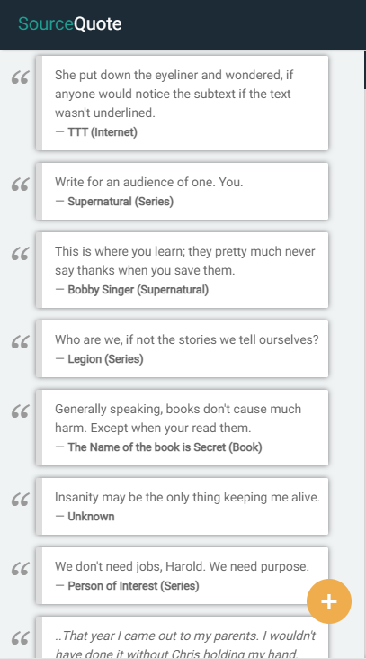
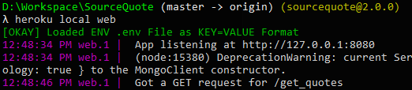

# SourceQuote

> A website to put down the quotes that you read, heard, saw, thought and felt.



Checkout the Live site: [SourceQuote](https://vast-hollows-31190.herokuapp.com/).

* **Note:** The site may be down during deployment.

## Requirements

1. Node.js
2. Heroku CLI
3. MongoDB _(A local or remote installtion like Mongo Atlas)_

## Build

After downloading the clone of this repo, go to the clones path and:

1.Setup the project
  ```bash
npm install
  ```
2._(Optional)_ Start the mongo DB if using a local one.

3.Add a `.env` file in the root path with following properties
```env
DB=<Your_local_or_remote_DB_URL>
DBNAME=<Your_DB_NAME>
COLLECTION=<Your_DB_COLLECTION>
```
4.Start the server
  ```bash
heroku local web
  ```



Once started you can view the page at `http://localhost:8787`.

## Licence

MIT Licence. Free to copy, distribute and use.
